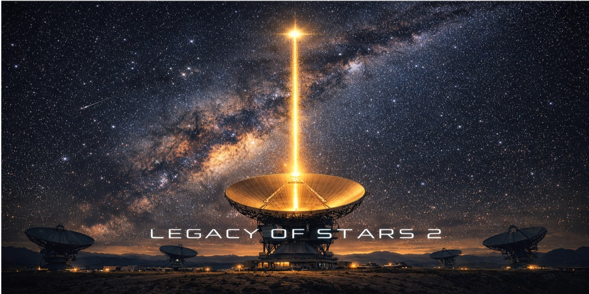

# Legacy of Stars



## Overview

Legacy of Stars is a turn-based strategy game about humanity's multi-generational effort to make
contact with alien civilizations. As the overseer of Earth's interstellar communication program you
make decisions that span centuries: each turn is one generation (~25 years) with a new director,
messages take years or decades to arrive, and the answers you receive may be friendship, silence,
or a fleet.

Inspired by the "Dark Forest" theory and by the real history of SETI, the game starts on
August 15, 1977 - the night of the WOW! signal - and asks whether Earth should reply.

## Play in the browser

`https://mikhashev.github.io/legacy-of-stars-2/` - live once the `.github/workflows/web.yml`
Pages workflow has run against `main`.

The web version is the same game and the same Python engine (`src/`), run in the browser
through [Pyodide](https://pyodide.org) (Python-in-WebAssembly, in a Web Worker) instead of a
console; the HUD is Preact and the star map is a real 3D scene (Three.js) with the messages,
fleets, Genesis arks and the leakage front animated off the engine's own event stream. Saves
live in the browser (`localStorage`) with JSON export/import compatible with the console's
`saves/*.json`. See [web/README.md](web/README.md) for the full architecture.

Build and run it locally:

```bash
cd web
npm ci
npm run build      # scripts/build_web_engine.py packs src/ + data/ into public/engine.zip first
npm run preview     # http://localhost:4173 - Pyodide needs a real server, file:// will not do
```

```bash
npm run unit        # Vitest: the pure scene modules (map coordinates, animation timing)
npm test            # Playwright: full playthroughs, the 3D map, animations, layout, GitHub Pages fixtures
```

## Playing (console)

Requirements: Python 3.9 or newer. No packages to install; the game uses only the standard library.

```bash
git clone https://github.com/mikhashev/legacy-of-stars-2.git
cd legacy-of-stars-2
python run_game.py
```

The start menu offers **New Game**, **Load Game** and **Quit**. The game autosaves after every
generation into `saves/` and you can save manually at any time.

| Key | Action |
|-----|--------|
| 1 | Send a message to a star system (1 AP) |
| 2 | Focus research on a star system (1 AP) |
| 3 | Public outreach campaign (1 AP) |
| 4 | Research technology (free) |
| 5 | Advance to the next generation |
| 6 | Quit |
| 7+ | Situational actions: defensive actions, AI advisor, swan songs, Genesis Project, philosophical crises |
| v | Dossier of a star system (full message history) |
| s | Save game |
| h / ? | The rules, in game |

Action Points renew every generation (2 base, more with high support, funding and a capable
director). Research Points accumulate from funding and from the instruments you build.

## What the game is about

- **Light-speed contact.** Replies travel at light speed; a system 12 light-years away answers a
  generation later. Hostile fleets are far slower, which is the only reason Earth gets time to prepare.
- **Hidden strategies.** Every civilization secretly listens only, broadcasts and befriends,
  answers cautiously, attacks in silence, or baits you with warmth before the fleet. Silence and
  questions about your position are the tells.
- **Discovery.** Real nearby stars (Proxima Centauri, Tau Ceti, TRAPPIST-1 ...) are catalogued
  over the game; detection technologies decide how quickly. Most of them are empty. Some hold the
  final transmissions of extinct civilizations.
- **The Great Filter.** Humanity's biology and technology drift apart. Integration technologies
  (bio-engineering, neural interfaces, consciousness upload) decide whether the self-destruct risk
  grows or recedes after the first thirty generations.
- **Legacy.** Reply to the WOW! signal in 1977 and the answer - if any - arrives in Generation 144.
- **Genesis.** Send arks to sterile worlds and, forty generations after landing, meet what grew.

**Winning:** replies from three living civilizations (contact victory) and/or 15 pieces of Fermi
Paradox evidence (philosophical victory). Both let the game continue.
**Losing:** defunding, self-destruction, or annihilation by a fleet you could not stop.

## Optional AI text

The game is complete without any language model: alien replies, swan songs, the strategic
advisor and the WOW! response all have written versions. If you run Ollama or LM Studio locally,
or set an Anthropic/OpenAI API key, the same texts are generated instead. See
[docs/ai_content_roadmap.md](docs/ai_content_roadmap.md) and `.env.example`.

## Development

```bash
python -m unittest discover -s tests -t . -v          # unit and end-to-end tests (offline)
LOS_SLOW=1 python -m unittest tests.test_balance -v   # statistical balance checks over whole games
python scripts/auto_playtest.py --runs 5 --seed 1     # headless playtest report
```

```
legacy-of-stars-2/
├── run_game.py                  # launcher: start menu, logging, console setup
├── src/
│   ├── legacy_of_stars_v3.py    # game engine (no I/O): state, actions, generation processing,
│   │                            #   available_actions(), view_state(), events, to_dict()/from_dict()
│   ├── game_interface.py        # console UI: menu, dossier, help, opening scenario, final report
│   ├── save_manager.py          # serialize/deserialize + save files
│   ├── summary.py               # final report and score
│   ├── content.py               # offline text bank (data/templates/*.json)
│   ├── ai_manager.py            # optional LLM client (Ollama / OpenAI-compatible / Anthropic)
│   ├── ai_strategic_advisor.py  # rule-based (or LLM) strategic briefing
│   ├── wow_signal_event.py      # WOW! signal decision and the Generation 144 outcome
│   ├── attack_warning.py        # incoming fleets and defensive actions
│   ├── passive_leakage.py       # Earth's electromagnetic leakage
│   ├── swan_song_messages.py    # final transmissions of extinct civilizations
│   ├── integration_progress.py  # the biological-technological transition
│   ├── philosophical_events.py  # mid-game crises with lasting choices
│   ├── genesis_project.py       # seeding sterile worlds
│   ├── console.py, ui_text.py   # terminal helpers, help text
│   └── web_api.py               # GameSession: the JSON facade the browser build calls (docs/web_contract.md)
├── data/
│   ├── tech_tree.json           # 44 technologies in 6 tiers, 1977 onward
│   ├── star_catalog.json        # real nearby stars with distances and coordinates
│   ├── templates/               # alien replies, swan songs, WOW! texts, special messages
│   └── llm_providers.json       # optional LLM providers
├── scripts/
│   ├── auto_playtest.py         # headless harness used by the tests
│   ├── build_web_engine.py      # packs src/ + data/ into web/public/engine.zip
│   └── make_web_fixtures.py     # builds web/tests/fixtures/*.json (fleet/reply/Genesis showcase saves)
├── tests/                       # unittest suites
├── web/                         # browser front-end: Pyodide + Three.js + Preact (web/README.md)
├── docs/                        # design notes and development history
└── legacy/                      # earlier engine versions (historical)
```

The engine is deliberately free of console I/O: it exposes the list of currently available
actions, a structured event stream and a player-visible state snapshot, so a graphical or web
front-end can be built on it without touching the rules - `src/web_api.py` and `web/` are exactly
that, built on the same engine with no rule changes.

## Status

**v1.0 - playable release.** Every mechanic described above is implemented, reachable and covered
by tests; complete games run headlessly without errors, both victories are achievable, and the
game can be saved and resumed. Earlier development history and design notes live in
[docs/development_roadmap.md](docs/development_roadmap.md) and [docs/design_notes.md](docs/design_notes.md).

## Contributing

Contributions are welcome! Please feel free to submit a Pull Request.

## License

This project is licensed under the MIT License - see the [LICENSE](LICENSE) file for details.

## Credits

- Developed by [Mike Shevchenko](https://github.com/mikhashev)
- Concept inspired by:
  - Scientific principles of interstellar communication
  - [@SETIInstitute](@SETIInstitute) research
  - [WOW! Signal](https://en.wikipedia.org/wiki/Wow!_signal)
  - Liu Cixin's "Dark Forest" theory
  - David Brin, "The Great Silence" (1983)
- Implementation created using [Personal Context Technology](https://github.com/mikhashev/personal-context-manager/blob/main/use-cases/game-development/README.md)
